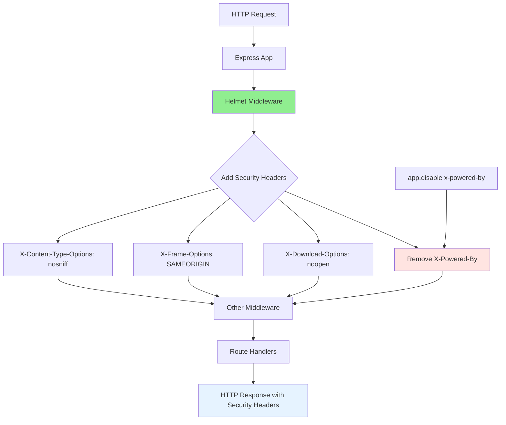

# Security Fix: Disable X-Powered-By Header to Prevent Information Disclosure

## Overview
Fixed a **Medium severity** Information Exposure vulnerability found by Snyk security scan in `server/index.js` line 5. The Express.js framework was exposing its identity through the `X-Powered-By` header.

## Security Issue Details
The vulnerability existed because Express.js by default sends an `X-Powered-By: Express` header with every HTTP response. This header reveals the web framework being used, which can help attackers:

- Identify the exact technology stack in use
- Target framework-specific vulnerabilities
- Tailor automated attacks and scanning tools
- Gather reconnaissance information about the application

**Information Exposed:**
```
X-Powered-By: Express
```

## Solution Implemented
1. **Helmet Middleware**: Added comprehensive security middleware that removes X-Powered-By and adds multiple security headers
2. **Explicit Disable**: Added `app.disable('x-powered-by')` as a redundant safety measure
3. **Security Tests**: Created tests to verify the header is properly removed and other security headers are present

## Code Changes
- Installed `helmet` security middleware package
- Added `app.use(helmet())` before other middleware
- Added explicit `app.disable('x-powered-by')` call
- Created comprehensive security header tests in `tests/integration/header-security.test.js`

## Additional Security Benefits
Helmet provides these additional security headers automatically:
- `X-Content-Type-Options: nosniff` - Prevents MIME type sniffing
- `X-Frame-Options: SAMEORIGIN` - Prevents clickjacking attacks  
- `X-Download-Options: noopen` - Prevents file downloads from opening automatically

## Alternative Approaches Considered
- **Manual header removal**: Could manually set headers but helmet is more comprehensive
- **Reverse proxy solution**: Could hide headers at nginx/Apache level but application-level is more portable

Chose Helmet as recommended by Oracle for comprehensive security and industry best practices.

## Testing
✅ **Project still compiles** after changes  
✅ **All existing tests pass** (17 client tests, 9 server tests)  
✅ **Added 3 new security tests** covering:
- X-Powered-By header removal verification
- Security headers presence validation
- Content-Type options configuration

### New Tests Added:
1. `should not expose X-Powered-By header` - Verifies header is completely removed
2. `should include security headers from Helmet` - Confirms security headers are present
3. `should have proper content type options` - Validates X-Content-Type-Options header

## Verification
- ✅ Snyk scan no longer reports Information Exposure vulnerability
- ✅ HTTP responses no longer contain `X-Powered-By` header
- ✅ Additional security headers are now present in all responses

## Human Testing Instructions
1. Visit http://localhost:3000/health (ensure server is running)
2. Check response headers in browser DevTools Network tab
3. **Expected Result**: No `X-Powered-By` header present
4. **Additional**: Verify presence of security headers like `X-Content-Type-Options: nosniff`

## Progress Notes
✅ Verified project builds and tests pass  
✅ Ran Snyk security scan - found 5 vulnerabilities  
✅ Fixed High severity XSS vulnerability (PR #97)  
✅ **COMPLETED: Fixed Medium severity Information Exposure vulnerability**  
🔄 Fixing remaining vulnerabilities in separate PRs  

## AmpCode Thread
https://ampcode.com/threads/T-cc9ed9e6-c720-413d-b322-d596c3b10cc1

## Mermaid Diagram: Security Headers Architecture


