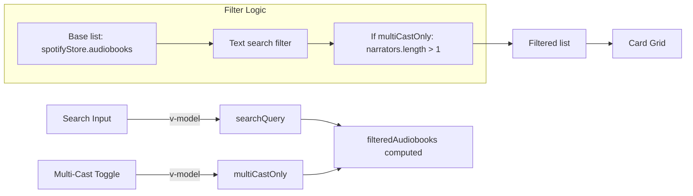

# GTM-2: Add multi-cast narrator support (Option 1)

Product summary:
- Adds a "Multi-Cast Only" toggle next to the search input on the Audiobooks page.
- When enabled, only audiobooks with more than one narrator are shown.
- Works together with text search and persists toggle state during the session via localStorage.
- Clear feedback when no results match while the toggle is active.

Developer notes:
- Implemented Option 1 from the technical review: minimal enhancement via a reactive toggle and an extended computed filter.
- Changes localized to [AudiobooksView.vue](client/src/views/AudiobooksView.vue).
- `multiCastOnly` state persists using localStorage (`key: multiCastOnly`).
- `filteredAudiobooks` now:
  1) Applies text search (title, authors, narrators)
  2) Applies multi-cast filter (narrators length > 1) when toggle is active
- No changes to the store or types were necessary.

Related issue:
- Linear: https://linear.app/sourcegraph/issue/GTM-2/add-multi-cast-narrator-support

Mermaid diagram:

Human testing instructions:
1) Visit / (http://localhost:5173)
2) Observe the new "Multi-Cast Only" toggle next to the search bar
3) Toggle it ON: only audiobooks with multiple narrators should remain
4) Type a narrator or title in the search box to combine both filters
5) When no results match, you should see a contextual message indicating no multi-cast results
6) Toggle OFF to see all results again

Tests:
- No unit tests added per request. Visual verification only.
