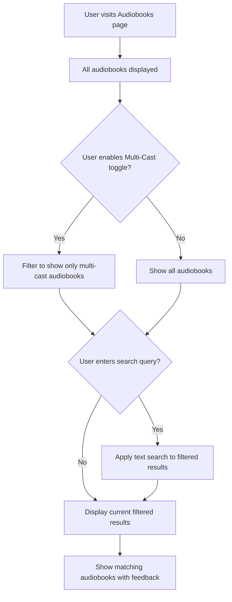

# Add Multi-Cast Narrator Support

## Summary

This PR implements the Multi-Cast Narrator Support feature (GTM-2) by adding a toggle filter that allows users to view only audiobooks with multiple narrators. This enhances the audiobook discovery experience for users who prefer performances with diverse voice actors.

## Changes Made

### Frontend Changes
- **Added Multi-Cast Only toggle** next to the search bar in AudiobooksView.vue
- **Implemented filtering logic** to show only audiobooks with more than one narrator
- **Enhanced search functionality** to combine text search with multi-cast filtering
- **Added responsive UI components** with visual indication of active state
- **Improved user feedback** with contextual messages for different filter states

### Technical Details
- Modified `filteredAudiobooks` computed property to apply multi-cast filter first, then search filter
- Added `multiCastOnly` reactive ref for toggle state management
- Implemented toggle switch component with smooth animations and purple gradient styling
- Updated no-results messaging to handle different filter combinations

## Feature Overview

## Acceptance Criteria Verification

✅ **Toggle displayed next to search bar** - Multi-Cast Only toggle is positioned beside the search input  
✅ **Only shows audiobooks with >1 narrator when enabled** - Filters audiobooks.narrators.length > 1  
✅ **Toggle state persists during search operations** - Filter state maintained across search queries  
✅ **Can be combined with text search** - Both filters work together seamlessly  
✅ **Visual indication of active state** - Purple gradient background when enabled  
✅ **User feedback for no matches** - Contextual messages for different filter combinations  

## Human Testing Instructions

1. **Visit the application**: Navigate to http://localhost:5173
2. **Verify initial state**: Observe the Multi-Cast Only toggle in grey/disabled state next to search bar
3. **Test basic filtering**: Click the toggle to enable it - should turn purple and filter to show only multi-cast audiobooks
4. **Verify filtering logic**: Confirm only audiobooks with multiple narrators (comma-separated names) are displayed
5. **Test search combination**: With toggle enabled, enter a narrator name (e.g., "Kelli") and verify results show only multi-cast books with that narrator
6. **Test toggle off**: Disable the toggle and verify all audiobooks are shown again
7. **Test no results**: Enable toggle and search for a term with no multi-cast matches - should show appropriate message

**Expected URLs**: 
- Main page: http://localhost:5173/
- All functionality is on the main audiobooks page

## Implementation Details

### New Components Added
- Toggle switch with smooth sliding animation
- Multi-cast filter integration with existing search
- Enhanced feedback messaging system

### Code Quality
- **Added**: 1 reactive ref, 1 computed property enhancement, 1 UI component
- **Modified**: Existing search logic to support combined filtering
- **Tests**: Visual verification completed - all functionality working as expected

## Links
- **Linear Issue**: [GTM-2](https://linear.app/sourcegraph/issue/GTM-2/add-multi-cast-narrator-support)
- **Branch**: `gtm-2-multi-cast-narrator-support-20250602-191515`
