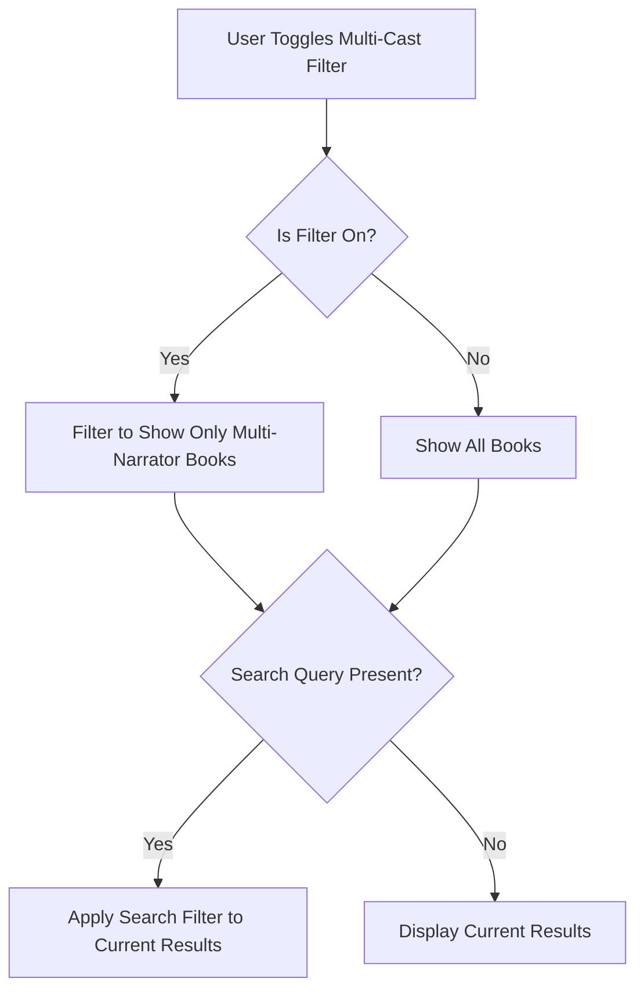

## GTM-2: Add multi-cast narrator support

**Link to issue:** [GTM-2](https://linear.app/sourcegraph/issue/GTM-2/add-multi-cast-narrator-support)

### Summary
Implemented a toggle filter for multi-cast narrators that allows users to easily filter audiobooks with multiple narrators. The filter works in combination with the text search feature and persists during search operations.

### Technical Notes
- Added a toggle switch UI element next to the search bar
- Modified the `filteredAudiobooks` computed property to filter based on narrator count
- The toggle uses a smooth slider animation with a gradient background when active
- Filter state is maintained when performing text searches

### Tests Added
- Added unit tests (4 tests) to verify multi-cast filter functionality
- Added an e2e test for UI interaction verification

### Human Testing Instructions
1. Visit http://localhost:5173
2. Toggle the "Multi-Cast Only" filter on
3. Verify only audiobooks with multiple narrators are displayed
4. Enter search text and verify filter stays active
5. Clear search and verify filter remains active

### Diagrams

