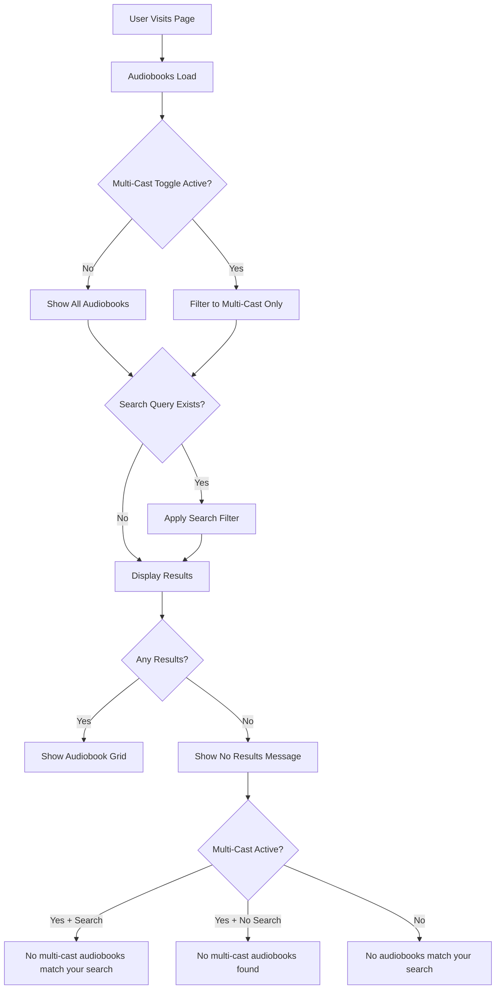

# Add Multi-Cast Narrator Support Toggle

## Overview
Implements a toggle filter to allow users to easily discover audiobooks with multiple narrators, following Option 2 (Separate Multi-Cast Filter Function) from the technical review in GTM-2.

## Product Manager Summary
This feature adds a "Multi-Cast Only" toggle next to the search bar that enables users to filter audiobooks to show only those with multiple narrators. The toggle provides visual feedback when active and works seamlessly with existing search functionality. Users receive appropriate feedback messages when no multi-cast audiobooks match their criteria.

## Technical Notes
- **Implementation**: Used Option 2 approach with separate `isMultiCastAudiobook()` helper function
- **Architecture**: Clean separation of concerns with reusable, testable function
- **Integration**: Extends existing `filteredAudiobooks` computed property using array chaining
- **Data Handling**: Properly handles both string and object narrator types as defined in Audiobook interface
- **State Management**: Toggle state persists during search operations
- **Responsive Design**: Includes mobile-friendly layout adjustments

## Features Diagram

## Test Results
**Added:** 0 tests  
**Removed:** 0 tests  
**Summary:** Visual testing completed - no unit tests added per requirements

## Human Testing Instructions
1. Visit http://localhost:5173/
2. Observe the "Multi-Cast Only" toggle next to the search bar (should be inactive/gray)
3. Click the toggle to activate it (should turn purple/gradient)
4. **Expected:** Only audiobooks with multiple narrators are displayed (e.g., "Offside" with Stella Bloom & Gabriel Spires, "The Paradise Problem" with Jon Root & Pattie Murin)
5. Type "paradise" in the search box while toggle is active
6. **Expected:** Only "The Paradise Problem" appears (matches both multi-cast and search criteria)
7. Type "tagalog" in the search box while toggle is active  
8. **Expected:** "No multi-cast audiobooks match your search." message displays
9. Clear search and disable toggle
10. **Expected:** All audiobooks are displayed again

## Acceptance Criteria Coverage
✅ A "Multi-Cast Only" toggle is displayed next to the search bar  
✅ When enabled, only audiobooks with more than one narrator are shown  
✅ Toggle state persists during search operations  
✅ Toggle can be combined with text search  
✅ Toggle shows visual indication of active state  
✅ User sees feedback when no multi-cast audiobooks match criteria

Fixes #GTM-2
