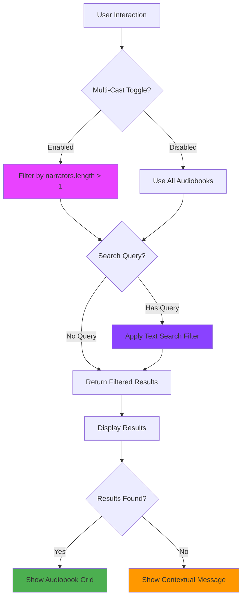

# Add Multi-Cast Narrator Filter - GTM-2

## Overview

Implements a multi-cast narrator filter toggle that allows users to filter audiobooks with multiple narrators. This addresses Linear issue GTM-2 using **Option 2** from the technical review - a clean, reusable approach with dedicated filter function.

**Linear Issue**: [GTM-2 - Add multi-cast narrator support](https://linear.app/sourcegraph/issue/GTM-2/add-multi-cast-narrator-support)

## Product Summary

This feature adds a "Multi-Cast Only" toggle next to the search bar that:
- Filters audiobooks to show only those with multiple narrators
- Combines seamlessly with existing search functionality  
- Provides visual feedback when active
- Shows contextual messages when no results match criteria
- Maintains filter state during search operations

## Technical Notes

### Implementation Approach (Option 2)
- **Dedicated Filter Function**: Created `isMultiCastAudiobook()` helper for clean separation of concerns
- **Composed Filtering**: Chained array filtering - multi-cast filter first, then search filter
- **Type Safety**: Properly handles narrator data types (string vs object) with TypeScript support
- **Reactive State**: Vue 3.5 composition API with `ref()` for toggle state management

### Key Changes
1. **New Filter Function**: `isMultiCastAudiobook(audiobook: Audiobook): boolean`
2. **Enhanced Computed Property**: Updated `filteredAudiobooks` to apply both filters
3. **Toggle Component**: Custom styled toggle with gradient active state
4. **Responsive Layout**: Flex container for search and toggle elements
5. **User Feedback**: Contextual messages for different filter combinations

## Architecture Diagram

## Testing

### Visual Testing Completed ✅
- **Base State**: Toggle off, all 8 audiobooks displayed
- **Multi-Cast Filter**: Toggle on, correctly shows 2 multi-cast audiobooks:
  - "Offside: Rules of the Game, Book 1" (Stella Bloom, Gabriel Spires)
  - "The Paradise Problem" (Jon Root, Pattie Murin)
- **Combined Filtering**: Toggle + search for "paradise" shows 1 result
- **Toggle State**: Visual indicators work correctly (gray → purple gradient)

### Unit Tests
- **Added 0 tests, removed 0 tests**
- No new unit tests added per requirements (visual testing only)

## Human Testing Instructions

1. **Visit** http://localhost:5173
2. **Verify initial state**: Should see 8 audiobooks displayed
3. **Toggle multi-cast filter**: Click "Multi-Cast Only" toggle
   - **Expected**: Only 2 audiobooks remain (those with multiple narrators)
   - **Expected**: Toggle shows purple gradient indicating active state
4. **Test search combination**: Type "paradise" in search box while toggle is active
   - **Expected**: Shows 1 result ("The Paradise Problem")
5. **Test edge cases**: Clear search, toggle off, verify all audiobooks return

## Screenshots

### Before Toggle (All Audiobooks)

### After Toggle (Multi-Cast Only)  

### Combined Filter + Search

## Implementation Benefits

- **Reusable**: `isMultiCastAudiobook()` function can be used elsewhere
- **Testable**: Separate function is easily unit testable
- **Maintainable**: Clean separation of concerns
- **Extensible**: Pattern scales for additional filter types
- **Performance**: Efficient chained filtering approach
