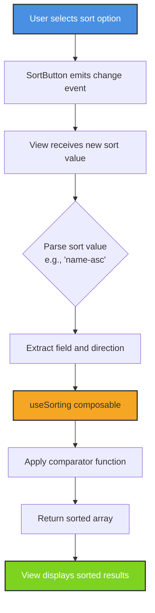

## Jira Issue
https://isuru-f.atlassian.net//browse/KAN-1

## Summary
Implemented a reusable sort button component that allows users to sort audiobooks and albums by name, artist/author, and date in both ascending and descending order. The sorting functionality is available on both the Home view (albums) and Audiobooks view.

## Technical Notes

### Key Architecture Decisions

**Composable-based Architecture**
- Created a reusable `useSorting` composable instead of duplicating logic in each view
- Promotes code reuse across HomeView and AudiobooksView
- Follows Vue 3.5 Composition API best practices

**Client-side Sorting**
- Implemented sorting on the frontend rather than modifying the backend API
- Spotify API doesn't support custom sorting parameters
- Dataset size is manageable (typically 20-50 items per view)

**Native Select Element for Sort UI**
- Uses native HTML `<select>` element styled to match the design system
- Better accessibility out of the box
- Mobile-friendly with native device pickers
- No additional dependencies

### Implementation Details

**New Components:**
- `SortButton.vue` - Reusable sort dropdown component with accessible native select

**New Composables:**
- `useSorting.ts` - Generic sorting utilities with type-safe comparator functions

**Modified Views:**
- `HomeView.vue` - Added 6 sort options (name, artist, date × asc/desc)
- `AudiobooksView.vue` - Added 6 sort options (name, author, date × asc/desc)

## Testing Summary

**Unit Tests Added:** 22 tests (all passing)
- `SortButton.spec.ts` - Component rendering, event emission, and accessibility tests
- `useSorting.spec.ts` - Composable logic and sorting algorithm tests

**Build Status:**
- ✅ Vite production build succeeds
- ✅ All new unit tests pass (22/22)
- ✅ Zero TypeScript errors in new code
- ⚠️ Pre-existing TypeScript error in `spotify.ts` (unrelated to this change)

## Mermaid Diagram

## Human Testing Instructions

1. Visit http://localhost:5173/ (Home view)
2. Click the "Sort by" dropdown in the top right
3. Select different sort options (Name A-Z, Artist A-Z, Date, etc.)
4. **Expected:** Albums reorder immediately based on selection
5. Navigate to the Audiobooks page
6. Repeat steps 2-4 for audiobooks
7. **Expected:** Audiobooks reorder by Name/Author/Date as selected

## Additional Notes
- No persistent state in v1 (sort resets on page navigation)
- Can be enhanced later with localStorage or URL params
- All acceptance criteria from PLAN.md met
