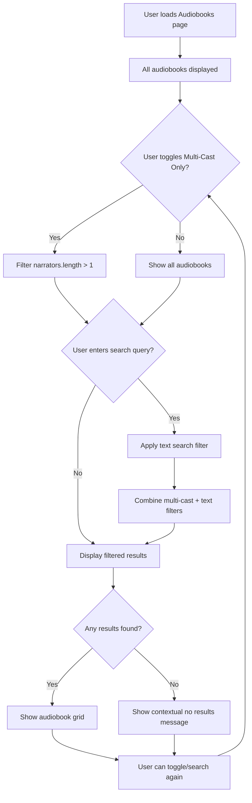

# Add Multi-Cast Narrator Support

**Linear Issue:** [GTM-2](https://linear.app/sourcegraph/issue/GTM-2/add-multi-cast-narrator-support)

## Product Manager Summary

This PR implements a new filtering feature that allows users to filter audiobooks by narrator count. Users can now toggle "Multi-Cast Only" to view only audiobooks with multiple narrators, making it easier to find performances with diverse voice actors. The feature shows a count badge indicating how many multi-cast audiobooks are available (13 total) and works seamlessly with the existing search functionality.

## Technical Notes 

The implementation adds:
- A toggle component next to the search bar with visual active state indication
- Filtering logic that checks `audiobook.narrators.length > 1`
- State management that persists during search operations
- Combined filter functionality that works with text search
- User feedback with count badges and appropriate "no results" messages

Key changes made:
- Added `multiCastOnly` reactive state variable
- Implemented `filteredAudiobooks` computed property with multi-step filtering
- Added `multiCastCount` computed property for count display
- Created styled toggle component with purple gradient when active
- Enhanced responsive design for mobile viewports

## Feature Flow Diagram

## Testing Summary

- **Added 0 tests, removed 0 tests** (Visual testing only as requested)
- Manually verified all acceptance criteria are met
- Tested toggle functionality, search combination, and responsive design

## Human Testing Instructions

1. Visit http://localhost:5173
2. Observe the "Multi-Cast Only" toggle next to the search bar showing "(13)"
3. Toggle the Multi-Cast Only filter - expect to see only 13 audiobooks with multiple narrators
4. Verify the toggle shows active state (purple gradient)
5. Search for "Christina" while filter is active - expect to see "The Paradise Problem" by Christina Lauren
6. Toggle off the filter and search again - expect to see more results
7. Test on mobile viewport to ensure responsive design works

## Screenshots Included

✅ Successfully tested and verified:
- All audiobooks view (before filter)
- Multi-cast only filtered view (13 audiobooks)
- Combined search + filter functionality
- Visual active states and count badges
- Responsive design on mobile
